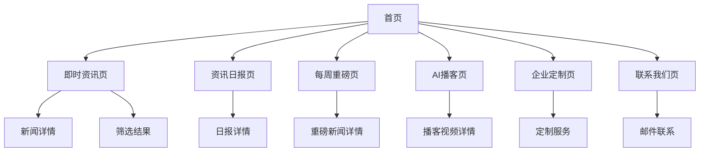

# Horus.AI 产品需求文档

## 1. 产品概述

Horus.AI 是一款AI驱动的跨境合规资讯网站，专为处理跨境合规业务的律师和企业法务人员提供智能化的合规资讯服务。产品名称灵感源自埃及神话中的荷鲁斯，象征着洞察力和保护。

* **副标题**：AI Legal RegTech

* **产品说明**：AI-Powered Legal News & Analysis

* **目标用户**：跨境合规律师、企业法务人员

* **核心价值**：通过AI技术提供精准、及时的合规资讯分析，帮助用户快速了解最新的法规动态和合规要求

## 2. 核心功能

### 2.1 用户角色

| 角色   | 注册方式 | 核心权限               |
| ---- | ---- | ------------------ |
| 普通用户 | 邮箱注册 | 浏览资讯、查看AI总结、访问基础功能 |
| 企业用户 | 企业认证 | 定制资讯服务、高级筛选、专属合规建议 |

### 2.2 功能模块

我们的Horus.AI合规资讯平台包含以下主要页面：

1. **首页**：英雄区域展示、产品介绍、最新资讯预览
2. **即时资讯页**：四大分类资讯展示、多维度筛选、实时更新
3. **资讯日报页**：按日汇总、综合分析、趋势展示
4. **每周重磅页**：重点新闻精选、深度解读、影响分析
5. **AI播客页**：AI播客视频展示、重大政策解读（暂不实质开发）
6. **企业定制页**：个性化资讯服务、定制化合规建议
7. **联系我们页**：邮件联系、服务咨询、反馈收集

### 2.3 页面详情

| 页面名称  | 模块名称  | 功能描述                                                                                            |
| ----- | ----- | ----------------------------------------------------------------------------------------------- |
| 首页    | 英雄区域  | 展示产品Logo、名称、副标题和核心价值主张，包含CTA按钮引导用户进入资讯页面                                                        |
| 首页    | 资讯预览  | 展示四大分类的最新资讯摘要，每类显示3-5条最新新闻                                                                      |
| 首页    | 产品特色  | 介绍AI解读、合规建议等核心功能特点                                                                              |
| 即时资讯页 | 分类导航  | 四大分类切换：中国管制/制裁、外国管制/制裁、数据合规/人工智能、外国媒体报道                                                         |
| 即时资讯页 | 筛选器   | 三维筛选：发布机构筛选、专业领域筛选（出口管制、经济制裁、数据合规、供应链合规、人工智能合规）、行业筛选（互联网、高科技、芯片、物流港口、汽车/电池、能源/光伏、制造业、金融/保险、消费品） |
| 即时资讯页 | 新闻列表  | 展示新闻卡片，包含标题、发布时间、发布机构、发布人、AI总结预览                                                                |
| 即时资讯页 | 新闻详情  | 完整新闻内容、AI解读按钮、生成针对性合规建议按钮、原文链接                                                                  |
| AI播客页 | 播客视频展示 | 展示AI播客视频列表，显示"敬请期待"状态（暂不实质开发） |
| AI播客页 | 政策解读 | 重大政策的AI播客解读内容，显示"敬请期待"状态（暂不实质开发） |
| 资讯日报页 | 日期选择器 | 选择查看特定日期的资讯汇总                                                                                   |
| 资讯日报页 | 日报内容  | 按分类汇总当日所有相关新闻，提供综合分析和趋势洞察                                                                       |
| 每周重磅页 | 周期选择  | 选择查看特定周期的重磅新闻                                                                                   |
| 每周重磅页 | 重磅新闻  | 精选6-7条当周最重要的合规新闻，提供深度解读和影响分析                                                                    |
| 企业定制页 | 定制表单  | 企业信息填写、行业选择、关注领域设定                                                                              |
| 企业定制页 | 服务介绍  | 定制化资讯服务说明、价格方案展示                                                                                |
| 联系我们页 | 联系表单  | 收集用户信息并调用飞书多维表格API新增记录，包含姓名、邮箱、公司、职位、电话、咨询主题、详细需求、提交时间等字段                                                                                |
| 联系我们页 | 联系信息  | 官方邮箱、服务时间、响应承诺                                                                                  |

## 3. 核心流程

**普通用户流程**：
用户访问首页 → 浏览产品介绍和最新资讯预览 → 进入即时资讯页 → 选择关注的分类 → 使用筛选器精确查找 → 查看新闻详情 → 使用AI解读和合规建议功能 → 查看原文链接获取更多信息

**企业用户流程**：
企业用户注册认证 → 访问企业定制页 → 填写定制需求表单 → 获得个性化资讯推送 → 查看专属合规建议 → 通过联系我们页面获取进一步服务

**内容管理流程**：
飞书多维表格数据更新 → API自动同步 → 内容分类和筛选 → AI处理和分析 → 前端展示更新

## 4. 用户界面设计

### 4.1 设计风格

* **主色调**：深蓝色渐变（#010030 到 #0161C6），体现专业性和科技感

* **辅助色**：白色、浅灰色（#f8fafc）、深灰色（#374151）

* **按钮样式**：圆角矩形按钮，支持悬停和点击动效

* **字体**：无衬线字体，主标题使用粗体，正文使用常规字重

* **布局风格**：卡片式布局，顶部导航栏，响应式网格系统

* **图标风格**：线性图标，统一的视觉风格，避免使用emoji

* **动效**：自然流畅的过渡动画，微交互反馈

### 4.2 页面设计概览

| 页面名称  | 模块名称  | UI元素                                                                                                                                                                         |
| ----- | ----- | ---------------------------------------------------------------------------------------------------------------------------------------------------------------------------- |
| 首页    | 英雄区域  | 深蓝色渐变背景，居中布局，产品Logo（<https://dachenglaw.oss-cn-beijing.aliyuncs.com/2025/08/14/1t8MWm.png），大标题"Horus.AI"，副标题"AI> Legal RegTech"，说明文字"AI-Powered Legal News & Analysis"，CTA按钮 |
| 首页    | 资讯预览  | 四列网格布局（移动端单列），每个分类卡片包含图标、标题、最新新闻条数、"查看更多"链接                                                                                                                                  |
| 即时资讯页 | 分类导航  | 水平标签页，支持滑动切换，当前选中状态高亮显示                                                                                                                                                      |
| 即时资讯页 | 筛选器   | 折叠式筛选面板，多选下拉菜单，筛选标签显示，清除筛选按钮                                                                                                                                                 |
| 即时资讯页 | 新闻列表  | 垂直卡片列表，每卡片包含新闻标题、发布机构标签、发布时间、发布人头像、AI总结预览、"AI解读"和"合规建议"按钮                                                                                                                    |
| 资讯日报页 | 日期选择器 | 日历组件，支持快速选择今天、昨天、本周等预设选项                                                                                                                                                     |
| 每周重磅页 | 重磅新闻  | 大卡片布局，突出显示重要性等级，包含详细的影响分析和专家点评                                                                                                                                               |

### 4.3 响应式设计

* **设计优先级**：移动端优先，桌面端适配

* **断点设置**：移动端（<768px）、平板端（768px-1024px）、桌面端（>1024px）

* **交互优化**：支持触摸手势，优化点击区域大小，确保良好的移动端体验

* **主题切换**：支持深色模式和浅色模式切换，用户偏好本地存储

## 5. 数据结构

### 5.1 新闻数据字段

基于飞书多维表格API，每条新闻包含以下字段：

* **新闻标题-中文**：新闻的中文标题

* **发布机构**：新闻发布的官方机构

* **配置列-仅日期**：新闻发布日期（yyyy-mm-dd格式）

* **AI 总结**：AI生成的新闻摘要和分析

* **原文链接**：新闻原文的URL链接

* **行业分类**：新闻涉及的行业分类标签

* **相关性判断**：内容相关性评估（仅显示"相关"的新闻）

* **role**：发布人角色（虚拟专家人物）

* **发布时间-北京-database**：精确的发布时间戳

### 5.2 筛选维度配置

**发布机构分类**：

* 中国管制/制裁：商务部、安管局、服贸司、国务院关税税责委员会、外交部、出口管制信息网

* 外国管制/制裁：OFAC-美国财政部｜海外资产控制办公室、BIS-美国商务部｜工业与安全局、CBP-美国海关与边境保护局、美国白宫、CCP-美国众议院｜美中战略竞争特设委员会、OFSI-英国财政部｜金融制裁实施办公室、DoD-美国司法部、美国财政部、欧盟委员会

* 数据合规/人工智能：IAPP、网信办、工信部、公安部、中国互联网金融协会、全国网络安全标准化技术委员会、国家标准化管理委员会

* 外国媒体报道：国会山、全球制裁

**专业领域**：出口管制、经济制裁、数据合规、供应链合规、人工智能合规

**行业分类**：互联网、高科技、芯片、物流港口、汽车/电池、能源/光伏、制造业、金融/保险、消费品

## 6. 特殊功能需求

### 6.1 AI功能集成

* **AI解读**：对新闻内容进行深度分析，提供法律条文解释、影响评估、相关案例参考（暂时不做实质功能，点击按钮后弹窗显示正在解读中，3秒后自动关闭弹窗）

* **生成针对性合规建议**：基于用户行业和关注领域，生成个性化的合规操作建议（暂时不做实质功能，点击按钮后弹窗显示正在分析企业基本情况，3秒后自动关闭弹窗）

* **智能推荐**：根据用户浏览历史和偏好，推荐相关新闻和合规信息

* **AI播客功能**：暂不实质开发，页面显示"敬请期待"状态

### 6.2 企业定制服务

* **个性化资讯推送**：根据企业行业特点和关注领域，定制专属资讯内容

* **合规风险预警**：基于最新法规变化，提供潜在合规风险提醒

* **专家咨询对接**：提供专业律师和合规专家的咨询服务对接

### 6.3 空状态处理

对于尚未上线的功能页面，显示"敬请期待"的友好提示，包含预计上线时间和功能预告，保持用户期待和参与度。
