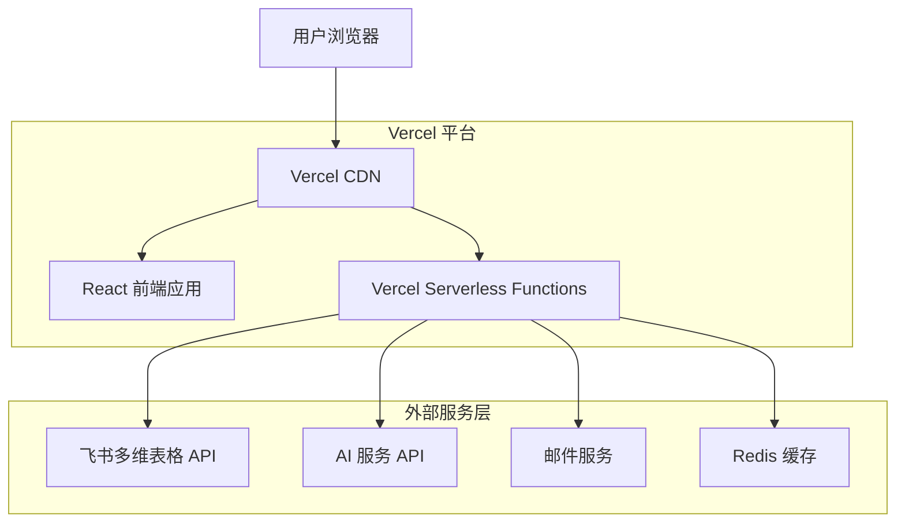
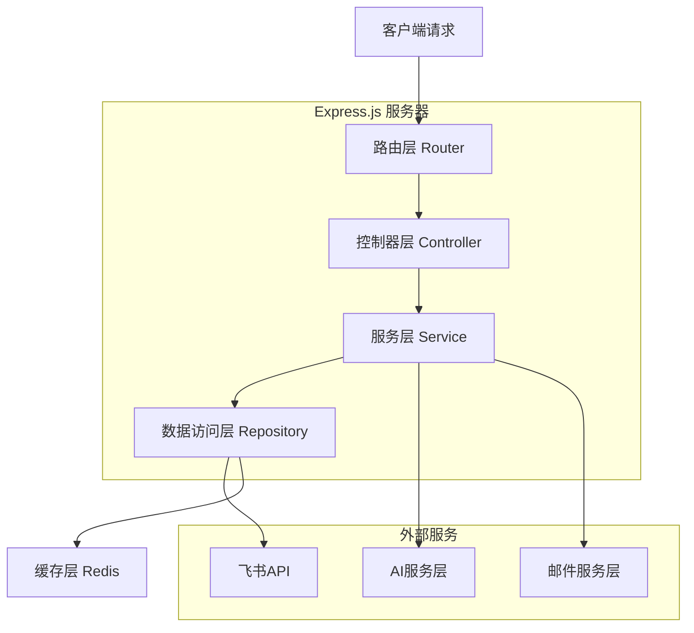
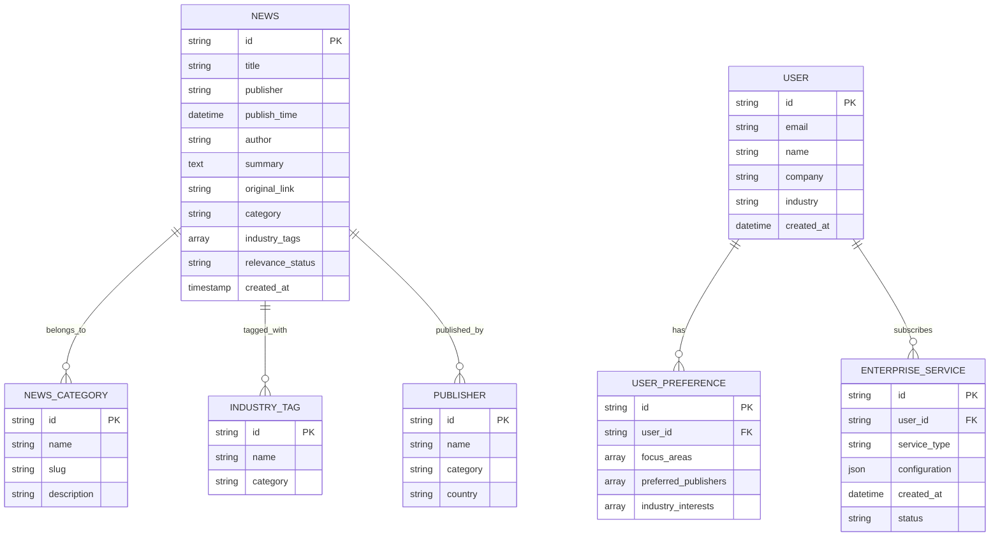

# Horus.AI 技术架构文档

## 1. 架构设计



## 2. 技术描述

* **前端**：React\@18 + TypeScript + Tailwind CSS + Vite + React Router

* **后端**：Express.js\@4 + TypeScript + Node.js

* **缓存**：Redis（用于API响应缓存和会话管理）

* **外部服务**：飞书多维表格API、AI服务API、邮件服务

* **部署**：Vercel 云平台部署

## 3. 路由定义

| 路由               | 用途                  |
| ---------------- | ------------------- |
| /                | 首页，展示产品介绍和最新资讯预览    |
| /news            | 即时资讯页，四大分类新闻展示和筛选   |
| /news/:category  | 特定分类的资讯页面           |
| /news/detail/:id | 新闻详情页，包含AI解读和合规建议功能 |
| /daily           | 资讯日报页，按日期汇总新闻       |
| /weekly          | 每周重磅页，精选重要新闻        |
| /podcast         | AI播客页，展示AI播客视频和政策解读（暂不实质开发） |
| /enterprise      | 企业定制服务页面            |
| /contact         | 联系我们页面              |
| /api/docs        | API文档页面（开发环境）       |

## 4. API定义

### 4.1 核心API

**新闻数据获取**

```
GET /api/news
```

请求参数：

| 参数名       | 参数类型   | 是否必需  | 描述                                                              |
| --------- | ------ | ----- | --------------------------------------------------------------- |
| category  | string | false | 新闻分类：china-sanctions, foreign-sanctions, data-ai, foreign-media |
| publisher | string | false | 发布机构筛选                                                          |
| field     | string | false | 专业领域筛选                                                          |
| industry  | string | false | 行业分类筛选                                                          |
| page      | number | false | 页码，默认1                                                          |
| limit     | number | false | 每页数量，默认20                                                       |
| date      | string | false | 日期筛选，格式：YYYY-MM-DD                                              |

响应：

| 参数名          | 参数类型    | 描述      |
| ------------ | ------- | ------- |
| success      | boolean | 请求状态    |
| data         | object  | 新闻数据    |
| data.items   | array   | 新闻列表    |
| data.total   | number  | 总数量     |
| data.page    | number  | 当前页码    |
| data.hasMore | boolean | 是否有更多数据 |

示例响应：

```json
{
  "success": true,
  "data": {
    "items": [
      {
        "id": "recuTLt37HJgCX",
        "title": "财政部针对墨西哥恐怖主义及分时度假欺诈行为实施制裁",
        "publisher": "美国财政部",
        "publishTime": "2025-08-13",
        "author": "Harvey",
        "summary": "AI总结内容...",
        "originalLink": "https://home.treasury.gov/news/press-releases/sb0222",
        "industry": "行业通用",
        "category": "foreign-sanctions"
      }
    ],
    "total": 556,
    "page": 1,
    "hasMore": true
  }
}
```

**AI解读服务**

```
POST /api/ai/analysis
```

请求：

| 参数名          | 参数类型   | 是否必需  | 描述                                      |
| ------------ | ------ | ----- | --------------------------------------- |
| newsId       | string | true  | 新闻ID                                    |
| analysisType | string | true  | 分析类型：interpretation 或 compliance-advice |
| userIndustry | string | false | 用户所在行业                                  |

响应：

| 参数名                  | 参数类型    | 描述     |
| -------------------- | ------- | ------ |
| success              | boolean | 请求状态   |
| data                 | object  | AI分析结果 |
| data.content         | string  | 分析内容   |
| data.keyPoints       | array   | 关键要点   |
| data.recommendations | array   | 建议事项   |

**企业定制服务**

```
POST /api/enterprise/customize
```

请求：

| 参数名          | 参数类型   | 是否必需  | 描述     |
| ------------ | ------ | ----- | ------ |
| companyName  | string | true  | 企业名称   |
| industry     | string | true  | 所属行业   |
| focusAreas   | array  | true  | 关注领域   |
| contactEmail | string | true  | 联系邮箱   |
| requirements | string | false | 具体需求描述 |

响应：

| 参数名       | 参数类型    | 描述   |
| --------- | ------- | ---- |
| success   | boolean | 请求状态 |
| message   | string  | 响应消息 |
| serviceId | string  | 服务ID |

**联系我们**

```
POST /api/contact
```

请求：

| 参数名     | 参数类型   | 是否必需  | 描述    |
| ------- | ------ | ----- | ----- |
| name    | string | true  | 联系人姓名 |
| email   | string | true  | 联系邮箱  |
| company | string | false | 公司名称  |
| position | string | false | 职位 |
| phone | string | false | 联系电话 |
| subject | string | true  | 咨询主题    |
| message | string | true  | 详细需求  |

响应：

| 参数名     | 参数类型    | 描述   |
| ------- | ------- | ---- |
| success | boolean | 提交状态 |
| message | string  | 响应消息 |

功能说明：
- 调用飞书多维表格API新增记录
- API配置：app_token: "RLTLbxKOEatXU3s1JM6csWhmnd4", table_id: "tblp4jp339vBgMjp"
- 自动添加提交时间字段

示例：
```json
{
  "name": "张三",
  "email": "zhangsan@example.com",
  "company": "ABC公司",
  "position": "法务总监",
  "phone": "13800138000",
  "subject": "企业定制服务咨询",
  "message": "希望了解企业定制服务详情"
}
```

## 5. 服务器架构图



## 6. 数据模型

### 6.1 数据模型定义



### 6.2 飞书多维表格映射

**新闻数据表结构映射**：

```typescript
// 飞书API响应数据结构
interface FeishuNewsRecord {
  record_id: string;
  fields: {
    '新闻标题-中文': Array<{text: string; type: string}>;
    '发布机构': Array<{text: string; type: string}>;
    '配置列-仅日期': {type: number; value: number[]};
    'AI 总结': Array<{text: string; type: string}>;
    '原文链接': Array<{text: string; type: string}>;
    '行业分类': string;
    '相关性判断': Array<{text: string; type: string}>;
    'role': Array<{text: string; type: string}>;
    '发布时间-北京-database': number;
  };
}

// 应用内部数据结构
interface NewsItem {
  id: string;
  title: string;
  publisher: string;
  publishTime: string;
  author: string;
  summary: string;
  originalLink: string;
  industry: string;
  category: string;
  relevanceStatus: string;
  timestamp: number;
}
```

**飞书API配置**：

```typescript
// API配置常量
const FEISHU_CONFIG = {
  baseUrl: 'https://open.feishu.cn/open-apis/bitable/v1',
  tenantToken: 't-g1048e33CDMX6PAVPZWS76F4LIWDEUGHY6H33IN6',
  categories: {
    'china-sanctions': {
      appToken: 'C3tXbZ9hoatPFrsw9v5cwZdlnog',
      tableId: 'tblxws3UgH8PrLNk'
    },
    'foreign-sanctions': {
      appToken: 'Bkasbun8ua4fQ6suGjvcKGT3nre',
      tableId: 'tbl6aOnlKdxnVqj6'
    },
    'data-ai': {
      appToken: 'MxkwbaX9ia5W7Xsaw9gc1UZdnQd',
      tableId: 'tblYatZd4nlatmkA'
    },
    'foreign-media': {
      appToken: 'TmgwbOtkfaNbUZsg0qxceZArngg',
      tableId: 'tblIN0LGHKo5jNPF'
    }
  }
};
```

## 7. 缓存策略

### 7.1 Redis缓存配置

* **新闻数据缓存**：缓存时间30分钟，键格式：`news:{category}:{filters_hash}`

* **AI分析结果缓存**：缓存时间24小时，键格式：`ai_analysis:{news_id}:{analysis_type}`

* **用户会话缓存**：缓存时间7天，键格式：`session:{user_id}`

* **API响应缓存**：缓存时间15分钟，键格式：`api_response:{endpoint}:{params_hash}`

### 7.2 缓存更新策略

* **定时更新**：每15分钟从飞书API拉取最新数据

* **手动刷新**：提供管理接口手动清除缓存

* **智能失效**：检测到新数据时自动失效相关缓存

## 8. 部署架构

### 8.1 Vercel 部署配置

**部署优势**：
- 自动化CI/CD：Git推送自动触发部署
- 全球CDN加速：静态资源全球分发
- 无服务器架构：自动扩缩容，按需付费
- 零配置部署：无需服务器运维
- 预览部署：每个PR自动生成预览环境

**Vercel配置文件**：

```json
// vercel.json
{
  "version": 2,
  "builds": [
    {
      "src": "api/**/*.ts",
      "use": "@vercel/node"
    },
    {
      "src": "package.json",
      "use": "@vercel/static-build",
      "config": {
        "distDir": "dist"
      }
    }
  ],
  "routes": [
    {
      "src": "/api/(.*)",
      "dest": "/api/$1"
    },
    {
      "src": "/(.*)",
      "dest": "/index.html"
    }
  ],
  "env": {
    "FEISHU_TENANT_TOKEN": "@feishu-tenant-token",
    "AI_SERVICE_API_KEY": "@ai-service-api-key",
    "REDIS_URL": "@redis-url"
  }
}
```

### 8.2 环境变量配置

**生产环境变量**：

```bash
# Vercel 环境变量设置
NODE_ENV=production
FEISHU_TENANT_TOKEN=t-g1048e33CDMX6PAVPZWS76F4LIWDEUGHY6H33IN6
AI_SERVICE_API_KEY=your_ai_service_key
REDIS_URL=redis://your-redis-instance:6379
```

**构建脚本配置**：

```json
// package.json
{
  "scripts": {
    "build": "vite build",
    "vercel-build": "npm run build"
  }
}
```

## 9. 安全考虑

### 9.1 API安全

* **访问令牌管理**：飞书API令牌安全存储，定期轮换

* **请求限制**：实施API请求频率限制，防止滥用

* **数据验证**：所有输入数据进行严格验证和清理

* **HTTPS强制**：生产环境强制使用HTTPS协议

### 9.2 数据安全

* **敏感信息加密**：用户邮箱等敏感信息加密存储

* **访问日志**：记录所有API访问日志，便于审计

* **错误处理**：避免在错误信息中泄露敏感系统信息

## 10. 性能优化

### 10.1 前端优化

* **代码分割**：按路由进行代码分割，减少初始加载时间

* **图片优化**：使用WebP格式，实施懒加载

* **CDN加速**：静态资源使用CDN分发

* **缓存策略**：合理设置浏览器缓存策略

### 10.2 后端优化

* **数据库连接池**：优化数据库连接管理

* **异步处理**：AI分析等耗时操作异步处理

* **压缩传输**：启用Gzip压缩减少传输数据量

* **监控告警**：实施性能监控和异常告警机制

